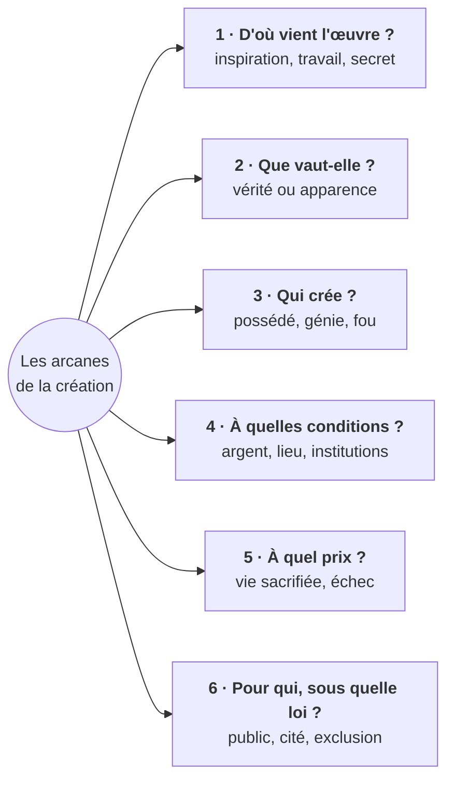

# Les arcanes de la création : carte des croisements

> - **Type de document** : carte des croisements, vue transversale du thème pour la dissertation.
> - **Thème** : « Les arcanes de la création » (thème 2, concours 2027).
> - **Œuvres** : Platon, *Ion* et *République* X, 595a-608b (trad. Canto-Sperber et Leroux) ; Zola, *L'Œuvre* ; Woolf, *Un lieu à soi* (trad. Darrieussecq).
> - **Statut** : **ÉCHANTILLON / prototype — généré le 24/09/2026, à valider.**
> - **Mode d'emploi** : lis le titre du thème, puis la carte (§ 1) et le tableau (§ 2) ; pour t'interroger, cache une colonne du tableau et retrouve un exemple par œuvre avant d'ouvrir les blocs repliés.
>   Traite un sujet du § 3 en 20 min avant d'ouvrir le plan ; les § 4 et 5 enrichissent une sous-partie.

**Références** : Stephanus pour Platon (*Ion* 534b, *Rép.* 597e), chapitres pour Zola (1-12) et Woolf (1-6).

## Le titre du thème

- **Arcanes** : du latin *arcanum*, « secret » (mot apparenté à *arca*, le coffre). C'est le mot des alchimistes et des initiés : un savoir caché, qui ne se transmet pas à tous.
- **Création** : au sens fort, théologique, faire être à partir de rien ; au sens courant, produire une œuvre originale. Le mot désigne l'acte, l'œuvre, et même le monde créé : pour Zola, l'œuvre d'art est « un coin de la création vu à travers un tempérament » [à vérifier] (*Mes Haines*, 1866).
- **Tensions à exploiter** : le secret peut-il être percé, c'est-à-dire expliqué, enseigné, transmis ? Qui crée vraiment, le dieu (*Rép.* 597b-d), la Muse ou l'homme ? Le secret est-il mystique (don, inspiration) ou très prosaïque : l'hérédité chez Zola, l'argent et la pièce à soi chez Woolf ?

## 1. Carte : six grandes questions

Chaque branche correspond à une ou plusieurs lignes du tableau (§ 2), dans le même ordre et avec les mêmes numéros.

## 2. Tableau notions × œuvres

Version courte, pour la vue d'ensemble et le PDF. Le détail de chaque case est dans l'autotest qui suit.

| Notion | Platon | Zola, *L'Œuvre* | Woolf, *Un lieu à soi* |
|---|---|---|---|
| **1a. Inspiration ou travail** | Chaîne de l'aimant ; Tynnichos (*Ion* 533d-534e) | Vision de la Cité (ch. 8) ; labeur de Sandoz (ch. 7, 9) | Pensée commune (ch. 4) ; Shakespeare sans entrave (ch. 3) |
| **1b. Le secret : l'expliquer, le transmettre ?** | Ion ne sait dire ni pourquoi ni sur quoi (*Ion* 532b-533d, 539e-541e) | Physiologie selon Sandoz (ch. 6) ; déséquilibre héréditaire (ch. 9) | Une opinion, pas une vérité (ch. 1) ; Shakespeare insaisissable (ch. 3) |
| **2. Vérité et imitation** | Trois lits ; imitateur au troisième rang (*Rép.* 597b-e) | Roman fondé sur la science (ch. 6) ; toile devenue idole (ch. 9, 12) | Fiction plus vraie que les faits (ch. 1, 3) |
| **3. Figure du créateur** | Poète possédé (*Ion* 534a-b) ; peintre magicien (*Rép.* 598c-d) | Claude, « génie incomplet » (ch. 9) ; Bongrand qui décline (ch. 7, 10) | Femme de génie folle ou sorcière (ch. 3) ; esprit androgyne (ch. 6) |
| **4. Conditions matérielles et sociales** | Couronnes et recettes (*Ion* 530a-d, 535d-e) ; cité (*Rép.* 607a) | Rente engloutie (ch. 2, 9) ; ateliers, jury, marchands (ch. 7-11) | Argent et pièce à soi (ch. 1) ; cinq cents livres, verrou (ch. 6) |
| **5a. Ce que coûte la création** | Ion pleure sans rien perdre (*Ion* 535b-d) ; âme déréglée (*Rép.* 605b-c) | Rente, fils, Christine, Claude dévorés (ch. 9-12) | Judith se tue (ch. 3) ; colère de Charlotte Brontë (ch. 4) |
| **5b. Inachèvement, échec** | Homère n'a rendu meilleure aucune cité (*Rép.* 599d-600e) | Toile inachevée, brûlée ; livres incomplets de Sandoz (ch. 12) | Œuvres qui n'ont pu naître (ch. 3) ; Mary Carmichael (ch. 5) |
| **6a. Public, réception** | Aimant jusqu'au spectateur (*Ion* 535e-536a) ; foule (*Rép.* 604e-605a) | Rires aux Refusés (ch. 5), silence au Salon (ch. 10) | Indifférence aux hommes, hostilité aux femmes (ch. 3) |
| **6b. Morale et cité** | Hymnes et éloges seuls admis ; ancien différend (*Rép.* 607a-e) | Refus (ch. 5, 8), puis admis par charité (ch. 10) ; l'enfant mort peint (ch. 9) | Austen, sans haine ni sermon (ch. 4) ; virilité stérile (ch. 6) |
| **6c. Genre, exclusion** | Plainte côté femmes, maîtrise côté hommes (*Rép.* 605d-e) | Christine : aquarelle d'agrément, puis modèle (ch. 4, 6, 9) | Pelouse interdite (ch. 1) ; miroirs grossissants (ch. 2) |

### Autotest : un exemple par œuvre

<b>1a.</b> Inspiration ou travail : un exemple par œuvre ?

- *Platon* : le poète compose par dispensation divine, non par art : c'est la chaîne de l'aimant (*Ion* 533d-534e). Tynnichos, qui n'a rien écrit d'autre de mémorable, a signé un péan que tout le monde chante, presque le plus beau des chants (534d-e).
- *Zola* : visions fulgurantes (la Cité, ch. 8) contre labeur : Sandoz écrit chaque matin (ch. 7, 9), Claude s'acharne sans finir (ch. 9). L'hérédité remplace la Muse.
- *Woolf* : les chefs-d'œuvre sont le fruit d'années de pensée commune (ch. 4). Le génie de Shakespeare suppose un esprit où toute rancœur s'est consumée, libre de toute entrave (ch. 3).

<b>1b.</b> Le secret de la création : peut-on l'expliquer, le transmettre ?

- *Platon* : Ion ne s'éveille que pour Homère sans savoir pourquoi : il ne parle donc pas par art et savoir (*Ion* 532b-533d). Il ne sait dire l'objet de son art (539e-541e) : il croit savoir ce qui convient à chacun, mais sur la laine, la fileuse en sait plus que lui (540b-c). Seul le dieu produit la Forme du lit (*Rép.* 597b-d).
- *Zola* : le secret devient physiologique. Sandoz veut étudier l'homme physiologique à travers une famille (ch. 6) ; Claude attribue ses échecs à un défaut d'équilibre nerveux, héréditaire (ch. 9).
- *Woolf* : la conférencière renonce à livrer une vérité toute faite ; elle n'offre qu'une opinion et le chemin qui y mène (ch. 1). De l'esprit de Shakespeare, on ne sait presque rien, car ses rancœurs ne transparaissent pas dans l'œuvre (ch. 3).

<b>2.</b> Création et vérité, imitation : un exemple par œuvre ?

- *Platon* : trois lits, la Forme (le dieu), l'objet (le menuisier), l'image (le peintre). L'imitateur est le troisième à partir de la vérité (*Rép.* 597e) : il copie une apparence, comme un miroir (596d-e, 598a-b).
- *Zola* : Sandoz veut un roman fondé sur la science (ch. 6), mais la toile de Claude tourne à l'idole, une femme nue (ch. 9, 12). *Un Déjeuner* de Fagerolles affadit *Plein air* (ch. 10).
- *Woolf* : la fiction dit parfois plus vrai que les faits : les trois Mary (ch. 1), Judith Shakespeare (ch. 3).

<b>3.</b> Figure du créateur (génie, folie, possession) : un exemple par œuvre ?

- *Platon* : le poète, « chose légère, ailée, sacrée » [à vérifier dans ton édition], ne compose que privé de raison (*Ion* 534a-b) ; Ion choisit de passer pour divin plutôt que pour malhonnête (542a-b). Le peintre abuse les enfants et les naïfs (*Rép.* 598c) : c'est un magicien, un imitateur (598d).
- *Zola* : Claude surprend derrière son dos le mot « génie incomplet » (ch. 9) [à vérifier dans ton édition] : névrose héréditaire, hallucinations, suicide (ch. 12). Bongrand ne peut plus égaler son chef-d'œuvre (ch. 7, 10).
- *Woolf* : une femme de génie au XVIe siècle serait devenue folle, se serait tuée ou aurait fini en sorcière redoutée (ch. 3). Le grand esprit est androgyne, selon Coleridge (ch. 6).

<b>4.</b> Conditions matérielles et sociales : un exemple par œuvre ?

- *Platon* : le rhapsode vit des concours et du public : prix, couronne d'or, recettes (*Ion* 530a-d, 535d-e). La cité admet ou non le poète (*Rép.* 607a).
- *Zola* : une rente de mille francs (ch. 2), entamée en capital puis engloutie (ch. 9) ; l'atelier commande la taille des toiles (ch. 8-9) ; jury, Salon, marchands (ch. 7, 10-11).
- *Woolf* : pour écrire, une femme doit avoir de l'argent et une pièce à elle (ch. 1) : cinq cents livres par an et une porte qui ferme à clé (ch. 6).

<b>5a.</b> Ce que coûte la création : un exemple par œuvre ?

- *Platon* : Ion, hors de lui, pleure sans avoir rien perdu (*Ion* 535b-d). Pour le spectateur, le coût est moral : l'âme se dérègle (*Rép.* 605b-c).
- *Zola* : l'œuvre dévore la rente, le fils mort devenu motif (*L'Enfant mort*, ch. 9), Christine, puis Claude (ch. 12). Sandoz avoue que le travail lui a pris toute son existence (ch. 9).
- *Woolf* : Judith Shakespeare se tue (ch. 3) ; la colère fait dévier l'œuvre de Charlotte Brontë (ch. 4). À l'inverse, l'héritage délivre la narratrice de la peur et de l'amertume (ch. 2).

<b>5b.</b> Œuvre inachevée, échec : un exemple par œuvre ?

- *Platon* : Homère n'a rendu meilleure aucune cité, conduit aucune guerre, laissé aucune règle de vie (*Rép.* 599d-600e) : l'échec du poète est un défaut de savoir.
- *Zola* : la grande toile reste inachevée, et Sandoz dit l'avoir mise en pièces et brûlée (ch. 12) : titre ironique. Lui-même juge ses livres incomplets (ch. 12).
- *Woolf* : l'œuvre des femmes est d'abord celle qui n'a pu exister : Judith, les poèmes anonymes (ch. 3) ; le roman de Mary Carmichael reste imparfait : donnons-lui cent ans (ch. 5).

<b>6a.</b> Public, réception, jugement : un exemple par œuvre ?

- *Platon* : l'aimant entraîne jusqu'au spectateur (*Ion* 535e-536a), qu'Ion guette en pensant à son salaire (535e). La foule aime le caractère emporté, facile à imiter (*Rép.* 604e-605a).
- *Zola* : rires aux Refusés (ch. 5), puis, au Salon, une indifférence pire que les huées, tandis qu'*Un Déjeuner* triomphe (ch. 10). Jory voit dans le scandale une réclame (ch. 5).
- *Woolf* : le monde est indifférent aux hommes qui écrivent, hostile aux femmes (ch. 3). Un livre sur la guerre passe pour important, un livre sur les sentiments féminins pour insignifiant (ch. 4).

<b>6b.</b> Création et morale, cité : un exemple par œuvre ?

- *Platon* : seuls les hymnes aux dieux et les éloges des gens de bien sont admis (*Rép.* 607a) ; ancien différend avec la philosophie (607b) ; retour possible si la poésie, ou ses défenseurs en prose, prouvent son utilité (607c-e).
- *Zola* : le jury refuse Claude (Refusés, ch. 5 ; trois refus, ch. 8), puis n'admet *L'Enfant mort* que par « charité » [à vérifier dans ton édition] et l'accroche trop haut (ch. 10) : une acceptation humiliante. Le culte de l'œuvre justifie-t-il de peindre son fils mort (ch. 9) ? Le roman ne tranche pas.
- *Woolf* : l'art ne doit pas prêcher : Jane Austen écrit sans haine ni sermon (ch. 4). L'affirmation virile, jusqu'à la poésie du fascisme, stérilise l'œuvre (ch. 6).

<b>6c.</b> Création et genre, exclusion : un exemple par œuvre ?

- *Platon* : le poète imitateur est écarté de la cité (*Rép.* 607a) ; la plainte qu'il fait aimer est rangée du côté des femmes, la maîtrise de soi du côté des hommes (605d-e). Lecture à assumer comme telle en copie.
- *Zola* : Christine, fille d'une peintre d'éventails, fait de l'aquarelle en amateur (ch. 1, 4) ; à Bennecourt, les sourires de Claude la découragent (ch. 6). Pour le reprendre à sa toile, elle copie ses esquisses un mois durant, puis renonce quand il oublie qu'elle est une femme, et revient à poser (ch. 9). Sandoz récuse pourtant le mythe de la femme qui tue l'artiste (ch. 6).
- *Woolf* : pelouse et bibliothèque interdites (ch. 1) ; les femmes, miroirs grossissants des hommes (ch. 2), omniprésentes dans la fiction, absentes de l'histoire (ch. 3) ; enfin l'amitié de Chloé et Olivia (ch. 5).

## 3. Trois sujets d'entraînement

> À la Banque PT, le sujet est tiré du texte à résumer : il faut d'abord dégager la **thèse de l'auteur**, puis la discuter. Les trois formules ci-dessous sont **forgées pour l'entraînement** (aucun auteur réel), suivies de la consigne « Dans quelle mesure votre lecture des œuvres au programme éclaire-t-elle ce propos ? » (forme exacte à vérifier dans les annales).
> Cache le plan, construis le tien en 20 min, puis compare. Chaque sous-partie : un argument, des exemples tirés d'au moins deux œuvres ; chaque partie : les trois œuvres.

### Sujet 1 : créer, est-ce travailler ?

**Formule** : « Le travail fait des ouvrages ; il ne fait pas des œuvres. »

- **Thèse et présupposés.** L'auteur sépare l'ouvrage, produit d'un savoir-faire, de l'œuvre, qui excède tout effort : créer ne serait pas travailler. Il suppose que l'œuvre vient d'ailleurs (don, inspiration) et que le travail se réduit à la répétition d'un métier.
- **Termes.** *Travail* : effort réglé qui transforme une matière selon une technique (peine, méthode, salaire). *Ouvrage* : produit fini d'un métier. *Œuvre* : création singulière, qui porte un nom et un sens. *Créer* : faire être ce qui n'existait pas ; le grec *poiein* (faire) a donné « poésie ».
- **Paradoxe.** On oppose la création, libre et inspirée, au travail, contraint ; pourtant tous les créateurs du corpus peinent, et le travail le plus acharné peut échouer.
- **Problématique.** Si toute œuvre suppose un effort méthodique, le travail ne produit-il pourtant que des ouvrages, ou créer est-il un travail d'une autre nature, qui excède le métier ?

<b>Plan détaillé</b>

**I. La thèse : l'œuvre semble échapper au travail**
1. *L'œuvre vient d'ailleurs.* Le poète compose par dispensation divine, non par art (*Ion* 533e-534c) ; Tynnichos prouve que le talent ne se mérite pas (534d-e). Claude reçoit la Cité en vision (ch. 8). L'esprit de Shakespeare, libre de toute entrave, semble créer sans résistance (Woolf, ch. 3).
2. *Le métier sans vision ne produit que des ouvrages.* Le poète imitateur pose sur les mots les couleurs d'arts qu'il ignore ; dépouillé de sa musique, son poème se flétrit comme un visage que la jeunesse a quitté (*Rép.* 601a-b). Fagerolles, habile, ne fait qu'affadir les trouvailles de Claude (ch. 10).

**II. Pourtant, pas d'œuvre sans travail**
1. *Le labeur quotidien.* Sandoz écrit chaque matin (ch. 7, 9) ; Bongrand, à chaque toile, se sent débutant (ch. 3 et 7). Aphra Behn gagne sa vie en travaillant dur, et avec elle, selon Woolf, commence la liberté de l'esprit (ch. 4). Ion lui-même dit que comprendre la pensée d'Homère est la part la plus laborieuse de son art (*Ion* 530b-c).
2. *Un travail collectif.* Les chefs-d'œuvre sont le fruit d'années de pensée commune (Woolf, ch. 4). Même l'inspiration de l'*Ion* passe par une chaîne (533d-536a), et le rhapsode récite pour un salaire (535e).

**III. Créer, c'est un travail d'une autre nature**
1. *Un travail sur soi plus que sur la matière.* Se délivrer de la colère (Charlotte Brontë, Woolf ch. 4), atteindre un esprit androgyne (ch. 6). Claude, qui s'acharne sur sa toile sans se délivrer de son obsession, échoue (ch. 9, 12). Pour Platon, ce qui manque à l'imitateur n'est pas l'effort mais le savoir : sans lui, l'imitation n'est qu'un jeu (*Rép.* 602b).
2. *Un travail qui se transmet.* La sœur de Shakespeare renaîtra si nous travaillons pour elle, même dans la pauvreté (Woolf, ch. 6). Sandoz répond à la mort de Claude par « Allons travailler » (ch. 12) [à vérifier dans ton édition] : le travail, éthique face à l'échec.

### Sujet 2 : l'artiste est-il maître de son œuvre ?

**Formule** : « L'artiste est le seul maître de son œuvre : il la conçoit, la conduit et en fixe le sens. »

- **Thèse et présupposés.** L'auteur fait de l'artiste un souverain, maître de la conception, de l'exécution et du sens. Il suppose que l'œuvre est un projet mené à terme, que son sens ne dépend pas du public, et que créer, c'est dominer.
- **Termes.** *L'artiste* produit une œuvre d'art ; l'artisan, lui, fabrique selon une règle connue. *Maître* : qui domine, qui a la maîtrise, qui possède, qui fixe le sens. *Son œuvre* : l'ouvrage, sa genèse, son destin ; le possessif pose déjà la question.
- **Paradoxe.** L'œuvre ne vient que de l'artiste, qui devrait la dominer ; or créer, c'est souvent être dépossédé : l'inspiration vient d'ailleurs, l'œuvre résiste, le public s'en empare.
- **Problématique.** L'artiste produit-il son œuvre en souverain, ou créer consiste-t-il à accepter qu'elle lui échappe, pour conquérir une autre forme de maîtrise ?

<b>Plan détaillé</b>

**I. La thèse : l'artiste semble maître de son œuvre**
1. *Il conçoit et planifie.* Sandoz expose le plan d'un cycle romanesque sur une famille (ch. 6), mise en abyme des *Rougon-Macquart* ; le menuisier fabrique en regardant la Forme (*Rép.* 596b) : un modèle guide la main.
2. *Il calcule ses effets.* Ion guette le public en pensant à son salaire (*Ion* 535e) ; la narratrice de Woolf invente les trois Mary (ch. 1) pour mener son auditoire à sa thèse.

**II. Mais l'œuvre lui échappe**
1. *Dans sa genèse.* Le dieu parle par la bouche du poète (*Ion* 534c-d) ; Claude peint en halluciné, à la bougie, la dernière nuit (ch. 12) : son hérédité agit en lui.
2. *Dans son exécution et sa réception.* La toile devient une rivale qui dévore la vie (ch. 9) ; la colère fait dévier le roman de Charlotte Brontë (Woolf, ch. 4) ; le public rit (ch. 5) ou se tait (ch. 10).

**III. Une maîtrise à conquérir : la liberté plutôt que la domination**
1. *L'indépendance matérielle.* Cinq cents livres et une porte à clé (Woolf, ch. 6) : être maître de son œuvre suppose de l'être de ses moyens, ce qu'on a refusé aux femmes (ch. 1). Claude dépend du jury (ch. 8, 10).
2. *Savoir ce qu'on fait, ou persévérer sans tout savoir.* Pour Platon, la maîtrise revient à l'usager, seul à savoir ; le fabricant n'a qu'une opinion droite, l'imitateur ni l'une ni l'autre (*Rép.* 601d-602a) ; la poésie ne reviendra que si elle ou ses défenseurs prouvent son utilité (607d-e). À défaut de ce savoir, reste la persévérance : Sandoz se méprise de n'écrire que des livres incomplets, mais conclut « Allons travailler » (ch. 12) [à vérifier dans ton édition]. Sa maîtrise serait alors la persévérance dans l'inachèvement, non la domination de l'œuvre (interprétation : sagesse ou fuite ?).

### Sujet 3 : la création a-t-elle besoin de conditions matérielles ?

**Formule** : « Ni l'argent ni le lieu ne font l'œuvre : le créateur ne dépend que de ce qu'il porte en lui. »

- **Thèse et présupposés.** L'auteur nie que la création dépende des conditions matérielles : tout viendrait de l'intériorité du créateur. Il suppose que le génie est donné, indépendant de la condition sociale, et que l'argent et le lieu ne sont que des accessoires.
- **Termes.** *L'œuvre, la création* : l'acte et son résultat. *Dépendre de* : avoir besoin de ; mais une condition nécessaire n'est pas suffisante. *Conditions matérielles* : argent, temps, lieu, outils, santé ; par extension, institutions, marché, statut social.
- **Paradoxe.** Que la création exige du papier et du pain semble trivial ; pourtant l'image du génie inspiré ou maudit l'affranchit de la matière.
- **Problématique.** Les conditions matérielles ne sont-elles que l'occasion de la création, ou décident-elles de qui peut créer ?

<b>Plan détaillé</b>

**I. La thèse : la création paraît indépendante de la matière**
1. *Le génie ne s'achète pas.* Le dieu choisit le médiocre Tynnichos (*Ion* 534d-e) ; Dubuche, qui a épousé l'argent, échoue (ch. 11).
2. *Le génie surmonte l'obstacle.* Jane Austen écrit dans le salon commun, sans pièce à elle (Woolf, ch. 4) ; Sandoz, petit employé de mairie qui aide sa mère (ch. 2), prétexte des enterrements pour prendre un jour et écrire (ch. 3).

**II. Sans conditions matérielles, la création avorte**
1. *L'argent et le lieu.* La fiction est une toile d'araignée attachée aux choses matérielles (Woolf, ch. 3). Claude peint à la mesure de ses ateliers (ch. 8-9) ; dans l'atelier glacial de Mahoudeau, la *Baigneuse* s'effondre au dégel (ch. 8).
2. *Le statut social.* La sœur de Shakespeare n'a ni instruction ni lieu (Woolf, ch. 3) ; Christine, cantonnée à l'aquarelle d'agrément (ch. 4, 6), renonce à peindre et n'est plus que modèle (ch. 9) ; le rhapsode dépend des concours (*Ion* 530a-b), le poète de la cité qui l'admet ou le chasse (*Rép.* 607a).

**III. Nécessaires mais pas suffisantes : elles conditionnent la liberté de l'esprit**
1. *La liberté intellectuelle dépend des choses matérielles* (Woolf, ch. 6) : l'héritage délivre la narratrice de la peur et de l'amertume (ch. 2). Claude a eu la rente et l'atelier sans la liberté intérieure : l'obsession consume ses moyens, et il finit dans la misère (ch. 9-12) ; la sécurité de Sandoz sert au contraire une discipline (ch. 9).
2. *Reste une condition immatérielle.* Pour Platon, c'est le savoir : si Homère avait su rendre les hommes meilleurs, on l'aurait retenu, comme Protagoras ou Prodicos, au lieu de le laisser errer de ville en ville (*Rép.* 600c-e) ; son errance révèle un défaut de savoir, non un génie qui triomphe de l'obstacle. Pour Woolf, c'est la liberté intérieure de l'esprit androgyne (ch. 6).

## 4. Cinq confrontations fécondes

1. **L'enthousiasme de l'*Ion* face au labeur de Claude Lantier** (*Ion* 533d-535a ; Zola, ch. 9, 12). Le poète possédé réussit sans travailler, Claude travaille sans fin et échoue ; tous deux perdent la maîtrise de l'œuvre, au profit de la Muse ou de l'hérédité. → L'inspiration est-elle le contraire du travail, ou son nom mythique ?
2. **Les trois lits face à *Un Déjeuner* de Fagerolles** (*Rép.* 597b-598c ; Zola, ch. 5, 10). Fagerolles adoucit *Plein air*, qui imitait déjà la nature : imitation d'imitation, que le public acclame, comme l'image peinte abuse les naïfs (598c). Mais chez Zola, c'est un peintre qui cherche le vrai. → Platon confirmé ou retourné ?
3. **Judith Shakespeare face à Christine** (Woolf, ch. 3 ; Zola, ch. 4, 6, 9, 12). L'une, douée, meurt de n'avoir pu créer ; l'autre, peintre d'agrément, s'essaie à copier Claude, y renonce, puis est dévorée par l'œuvre d'un autre. Woolf explique ce que Zola montre : sans argent ni lieu à soi, la femme est cantonnée à un art mineur, puis rendue au rôle de modèle ; elle reste objet de l'art plus que sujet.
4. **Le poète chassé de la cité, la femme chassée d'Oxbridge** (*Rép.* 605b, 607a-b ; Woolf, ch. 1-2). Le philosophe chasse le poète au nom du vrai, l'université la femme au nom d'une infériorité que des professeurs démontrent avec colère (ch. 2). Platon entrouvre la porte (607c-e) ; Woolf exhorte ses auditrices à écrire (ch. 6). → Qui décide de qui peut créer ?
5. **La chaîne de l'aimant face à la lignée des écrivaines** (*Ion* 533d-536a ; Woolf, ch. 4). La force créatrice descend de la Muse au poète, au rhapsode, au public ; chez Woolf, elle passe d'une génération d'écrivaines à l'autre, d'Aphra Behn aux romancières du XIXe siècle. → La création comme transmission, divine ou historique.

## 5. Références culturelles complémentaires

Une phrase chacune, jamais à la place des œuvres. En copie, deux ou trois bien placées suffisent : retiens d'abord les cinq premières.

1. **Aristote, *Poétique*, ch. 4 et 9.** Imiter est naturel à l'homme, qui apprend ainsi, d'où le plaisir pris même à l'image de choses pénibles ; la poésie, qui dit le général, est plus philosophique que l'histoire. → Réponse à *Rép.* X.
2. **Kant, *Critique de la faculté de juger* (1790), § 46-50.** Le génie, don naturel, donne ses règles à l'art ; il ne sait pas expliquer comment il produit, à la différence de Newton (§ 47) ; le goût doit le discipliner (§ 50). → L'*Ion* laïcisé.
3. **Balzac, *Le Chef-d'œuvre inconnu* (1831, remanié en 1837).** Frenhofer peint dix ans une femme idéale où Poussin et Porbus ne voient qu'un chaos de couleurs d'où sort un pied parfait ; il brûle ses toiles et meurt. → Ancêtre littéraire de Claude.
4. **Valéry.** Le faire prime l'inspiration : les dieux donnent le premier vers, à nous de façonner le second (*Au sujet d'Adonis*, 1921, repris dans *Variété*, 1924). → Thèse « créer, c'est travailler ».
5. **Linda Nochlin, « Pourquoi n'y a-t-il pas eu de grands artistes femmes ? » (1971).** La rareté des « grandes » femmes peintres tient aux institutions (exclusion des académies et du modèle nu), non au génie ; Beauvoir invoque aussi la situation, non la nature (*Le Deuxième Sexe*, 1949). → Prolonge Woolf, éclaire Christine.

<b>Pour aller plus loin</b> (cinq références de plus)

6. **Platon, *Phèdre* 244a-245a** (hors programme). La folie venue des Muses est un don divin ; qui aborde la poésie sans elle, croyant que la technique suffit, reste imparfait. → Confirme l'*Ion*.
7. **Diderot, *Paradoxe sur le comédien*** (publié en 1830). Le grand acteur n'éprouve pas ce qu'il joue : il en produit les signes de sang-froid ; la sensibilité fait les acteurs médiocres. → Ion pleure et calcule à la fois (535e).
8. **Nietzsche, *Humain, trop humain* (1878), § 155.** Les artistes ont intérêt à faire croire à l'inspiration soudaine ; en réalité, le jugement trie ce que l'imagination produit sans cesse (carnets de Beethoven). → Démystifie l'inspiration.
9. **Baudelaire, *Le Peintre de la vie moderne* (1863)**, sur Constantin Guys. La modernité est la moitié transitoire et fugitive de l'art, l'autre étant éternelle ; le génie retrouve à volonté le regard de l'enfance. → Claude veut peindre le Paris moderne.
10. **Rilke, *Lettres à un jeune poète*** (1903-1908, publiées en 1929). Nul ne peut conseiller le jeune poète : qu'il se demande dans la nuit s'il doit écrire et, si oui, qu'il bâtisse sa vie sur cette nécessité. → Créer engage une vie.

## Points à vérifier

Contrôle du 24/09/2026 sur le grec et une traduction anglaise de Platon, la traduction anglaise de *L'Œuvre* (Vizetelly, mêmes 12 chapitres) et le texte anglais de Woolf. Les formulations des traductions au programme restent à relever.

- **En priorité, livre en main (Zola)** : Christine et la peinture (ch. 1, 4, 6, et le mois de copie au ch. 9) ; les trois refus (ch. 8) ; la « charité » et l'accrochage (ch. 10) ; la *Baigneuse* (ch. 8) ; la toile brûlée (ch. 12) ; Sandoz employé de mairie (ch. 2) et ses faux enterrements (ch. 3).
- **Citations courtes** : « chose légère, ailée, sacrée », « génie incomplet », « Allons travailler », « un coin de la création » (*Mes Haines*).
- **Probablement justes, formulation seule à relever** : références Stephanus (dont *Ion* 530b-c, 540b-c, *Rép.* 605d-e) ; Woolf, ch. 4 (pensée commune, Aphra Behn) et ch. 6 (fascisme, liberté intellectuelle, retour de la sœur de Shakespeare).
- **Usages de Platon à ne pas renverser** : Homère errant (*Rép.* 600c-e) prouve un défaut de savoir, non un génie victorieux ; seul l'usager sait (601d-602a) ; la fileuse (*Ion* 540b-c) illustre le partage des techniques, non une hiérarchie des sexes.
- **Compléments** : titre français de Nochlin (traductions de 1993 et 2021) ; date d'*Au sujet d'Adonis* ; forme exacte de la consigne Banque PT.
- **Interprétations** : formules des sujets (forgées), paradoxes, problématiques, confrontations, lecture de Sandoz au ch. 12 : des pistes, pas des faits de texte.
